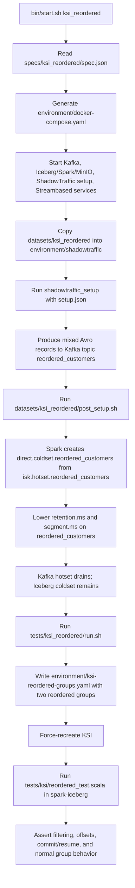

# KSI Reordered Flow

This document describes the runtime flow for the `ksi_reordered` spec.

The spec is a correctness test for KSI reordered consumer groups. It loads a small mixed dataset, moves it from Kafka hotset to Iceberg coldset, drains the Kafka topic, restarts KSI with reordered-group configuration, then validates filtered consumption, synthetic offsets, resume behavior, and normal unfiltered consumption.

## Spec

`specs/ksi_reordered/spec.json` selects:

- components: `kafka`, `iceberg`, `datagen-setup`, `streambased`
- setup dataset: `ksi_reordered`
- test runner: `tests/ksi_reordered/run.sh`

It does not define a background dataset.

## Runtime Flow



## Dataset Setup

`datasets/ksi_reordered/setup.json` writes records to:

```text
reordered_customers
```

The topic contains:

- random non-matching customer records
- four matching records where `Name = 'Reordered Match'`

The matching records are deliberately interleaved with non-matching records. That gives KSI a topic where a configured reordered group should return only the matching records while preserving deterministic synthetic offset order.

## Coldset Preparation

`datasets/ksi_reordered/post_setup.sh` copies `datasets/ksi_reordered/scala/post_setup.scala` into the `spark-iceberg` container and runs it with `spark-shell`.

The Scala script creates:

```scala
direct.coldset.reordered_customers
```

from:

```scala
isk.hotset.reordered_customers
```

The created Iceberg table is partitioned by `kafka_partition` and truncated `kafka_offset`.

After the copy, the shell script temporarily sets these Kafka topic configs on `reordered_customers`:

```text
retention.ms=500
segment.ms=500
```

It then restores both values to `604800000`. The intent is to drain the original Kafka hotset so the KSI test reads historical records from cold storage.

## KSI Reordered Configuration

`tests/ksi_reordered/run.sh` delegates to:

```text
tests/ksi/reordered_fresh.sh
```

That script rewrites:

```text
environment/ksi-reordered-groups.yaml
```

with two reordered groups:

```yaml
reorderedGroups:
  - groupId: "reordered-e2e-first-consume"
    clientId: "consumer-reordered-e2e-first-consume"
    sourceTopic: "reordered_customers"
    filter: "Name = 'Reordered Match'"
    orderBy: "kafka_timestamp ASC"
  - groupId: "reordered-e2e-resume"
    clientId: "consumer-reordered-e2e-resume"
    sourceTopic: "reordered_customers"
    filter: "Name = 'Reordered Match'"
    orderBy: "kafka_timestamp ASC"
```

Then it force-recreates KSI:

```bash
docker compose up -d --force-recreate ksi
```

The restart is needed because KSI mounts `environment/ksi-reordered-groups.yaml` at:

```text
/opt/kroxylicious/config/reordered-groups.yaml
```

## Test Execution

`tests/ksi/reordered_run.sh` copies these files into the `spark-iceberg` container:

- `tests/ksi/reordered_test.scala`
- `tests/common/scalatest_common.scala`

It concatenates them into a temporary Scala file and runs `spark-shell` with:

- ScalaTest
- Kafka clients
- Confluent Avro serializer

The test suite consumes through KSI at:

```text
ksi:9192
```

and uses Schema Registry at:

```text
http://schema-registry:8081
```

## Assertions

`tests/ksi/reordered_test.scala` validates:

1. A configured reordered group receives only records where `Name = 'Reordered Match'`.
2. Reordered records use synthetic monotonic offsets starting at `0`.
3. Commit and resume continues from the next synthetic offset without duplicates.
4. A normal consumer group on the same source topic remains unfiltered and sees both matching and non-matching records.

