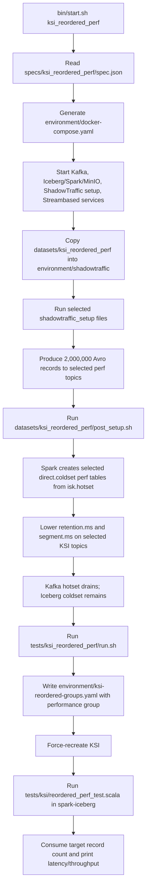

# KSI Reordered Performance Flow

This document describes the runtime flow for the `ksi_reordered_perf` spec.

The spec is a performance exercise for KSI reordered consumer groups. It loads a large all-matching dataset, moves it from Kafka hotset to Iceberg coldset, drains the Kafka topic, restarts KSI with reordered-group configuration, then consumes through KSI while reporting batch latency and throughput.

## Spec

`specs/ksi_reordered_perf/spec.json` selects:

- components: `kafka`, `iceberg`, `datagen-setup`, `streambased`
- setup dataset: `ksi_reordered_perf`
- test runner: `tests/ksi_reordered_perf/run.sh`

It does not define a background dataset.

## Runtime Flow



## Dataset Setup

`datasets/ksi_reordered_perf` now splits setup by benchmark case:

- `setup-baseline.json` writes `2,000,000` records to `reordered_perf_customers`.
- `setup-ordered.json` writes `2,000,000` records to `reordered_perf_customers_ordered`.
- `setup-kafka.json` writes `2,000,000` records to `reordered_perf_customers_kafka`.

Every generated record has:

```text
Name = "Reordered Perf Match"
```

The records also include a sequential `Sequence` field starting at `0`.

This dataset is much larger than the `ksi_reordered` dataset and is designed to measure sustained reordered consumption through KSI.

During full setup, `bin/start.sh` uses `REORDERED_PERF_CASES` to choose which setup files to run:

- `baseline` selects `setup-baseline.json`
- `ordered` selects `setup-ordered.json`
- `kafka` selects `setup-kafka.json`

For example, `REORDERED_PERF_CASES=baseline,kafka ./bin/start.sh ksi_reordered_perf` loads only the baseline KSI topic and the direct Kafka comparison topic.

## Coldset Preparation

`datasets/ksi_reordered_perf/post_setup.sh` copies `datasets/ksi_reordered_perf/scala/post_setup.scala` into the `spark-iceberg` container and runs it with `spark-shell`.

The Scala script creates selected coldset tables:

```scala
direct.coldset.reordered_perf_customers
direct.coldset.reordered_perf_customers_ordered
```

from:

```scala
isk.hotset.reordered_perf_customers
isk.hotset.reordered_perf_customers_ordered
```

The created Iceberg table is partitioned by `kafka_partition` and truncated `kafka_offset`.

The post-setup script also respects `REORDERED_PERF_CASES`. It copies only selected KSI topics into cold storage, and it does not create or drain coldset tables for unselected KSI cases. The direct Kafka baseline topic is not moved to cold storage.

After the copy, the shell script temporarily sets these Kafka topic configs on selected KSI topics:

```text
retention.ms=500
segment.ms=500
```

It then restores both values to `604800000`. The intent is to drain the original Kafka hotset so the KSI performance test reads historical records from cold storage.

## KSI Reordered Configuration

`tests/ksi_reordered_perf/run.sh` delegates to:

```text
tests/ksi/reordered_perf_fresh.sh
```

That script rewrites:

```text
environment/ksi-reordered-groups.yaml
```

with two reordered groups:

```yaml
reorderedGroups:
  - groupId: "reordered-e2e-performance"
    clientId: "consumer-reordered-e2e-performance"
    sourceTopic: "reordered_perf_customers"
    orderBy: "kafka_timestamp ASC"
  - groupId: "reordered-e2e-performance-ordered"
    clientId: "consumer-reordered-e2e-performance-ordered"
    sourceTopic: "reordered_perf_customers_ordered"
    orderBy: "kafka_timestamp ASC"
```

Then it force-recreates KSI:

```bash
docker compose up -d --force-recreate ksi
```

The restart is needed because KSI mounts `environment/ksi-reordered-groups.yaml` at:

```text
/opt/kroxylicious/config/reordered-groups.yaml
```

## Test Execution

`tests/ksi/reordered_perf_run.sh` copies these files into the `spark-iceberg` container:

- `tests/ksi/reordered_perf_test.scala`
- `tests/common/scalatest_common.scala`

It concatenates them into a temporary Scala file and runs `spark-shell` with:

- ScalaTest
- Kafka clients
- Confluent Avro serializer

The runner passes performance tuning variables into the `spark-iceberg` container:

- `REORDERED_PERF_TARGET_RECORDS`, default `1000000`
- `REORDERED_PERF_KSI_MAX_POLL_RECORDS`, default `50000`
- `REORDERED_PERF_KAFKA_MAX_POLL_RECORDS`, default `200`
- `REORDERED_PERF_POLL_TIMEOUT_SECONDS`, default `30`
- `REORDERED_PERF_EMPTY_POLLS`, default `3`
- `REORDERED_PERF_CASES`, default `ordered,baseline,kafka`

KSI-side batch size is configured with:

```bash
KSI_BATCH_SIZE
```

`KSI_BATCH_SIZE` replaces the previous separate cold-storage fetch and prefetch batch-size environment variables.

## Assertions And Metrics

`tests/ksi/reordered_perf_test.scala`:

1. Deletes the selected benchmark consumer groups.
2. Consumes selected KSI cases from `ksi:9192` and the direct Kafka baseline from `kafka1:9092`.
3. Polls selected topics until each reaches `REORDERED_PERF_TARGET_RECORDS` or hits the empty-poll limit.
4. Asserts the first synthetic offset is `0`.
5. Asserts each batch starts at the expected next synthetic offset.
6. Commits after each non-empty batch.
7. Prints batch latency and final throughput metrics.

The printed performance summary includes:

- target records
- consumed records
- batch count
- first and last offsets
- total elapsed time
- throughput in records per second
- average, p50, and p95 batch latency

For the full current run guide, including ISK-hot, preload, streaming-reader, and `KSI_BATCH_SIZE` examples, see:

```text
run_ksi_perf_test.md
```
